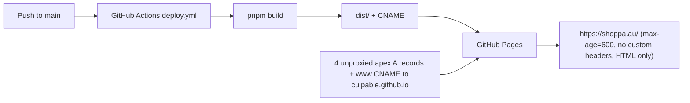

# Shoppa on Cloudflare Workers Migration Plan 🔄 **IN PROGRESS**

<critical_warning>
> **CRITICAL WARNING:** Production cutover changes DNS and one zone setting for `shoppa.au` only. Immediately before that write, record the complete live state of every record in zone `dae30eef9757b84c7217dbd9dd624ff9`, every Workers custom domain, every zone ruleset, the `always_use_https` setting, the bot-management object, and the GitHub Pages site state in `documents/guides/_hosting.md`, then commit it. Only the four apex `A` records, the one `www` `CNAME` record, and the `always_use_https` setting may change at cutover. The three Cloudflare Email Routing `MX` records, the apex SPF `TXT`, the `cf2024-1._domainkey` DKIM `TXT`, every `notifications.shoppa.au` record (Resend and Amazon SES), the `api`, `app`, and `demo` CNAMEs to Vercel, the Google Search Console `TXT`, and the `_github-pages-challenge-culpable` `TXT` must remain byte-identical. GitHub Pages stays live and undisabled until the Worker passes every production check so the recorded records can restore the previous host within minutes.
</critical_warning>

<important_note>
> **IMPORTANT NOTE:** Shoppa is already an Astro static site at the repository root, so this migration changes the host, the delivery contract, and the release path only; no page, layout, stylesheet, or copy changes except the privacy-notice hosting sentence (D-12). Every Cloudflare and GitHub action is agent-run through the macOS Keychain credential, the Cloudflare API, Wrangler, and `gh`. One precondition is user-owned and must be true before Step 4: the Cloudflare Workers and Pages GitHub App must have access to `Culpable/shoppa-root` (the user committed to granting it at `https://github.com/settings/installations` before execution; see D-4). Exactly one action needs the user during execution: the explicit approval to cut over after reviewing `https://staging.shoppa.au/`. The sibling migrations `/Users/sacino/fintrace-root/documents/todo/astro_workers_migration_plan.md` with evidence file `/Users/sacino/fintrace-root/documents/guides/cloudflare_workers_hosting.md`, and `/Users/sacino/bulma-root/documents/todo/astro_workers_migration_plan.md` with `/Users/sacino/bulma-root/documents/guides/_hosting.md`, are the proven procedure for every Cloudflare control-plane call in Steps 4 to 7; copy request shapes from those files rather than from memory. Until the GitHub Pages workflow is retired in Step 7, every push to `main` also deploys to GitHub Pages, so nothing pushed before cutover may change what `pnpm build` writes into `dist/` for a visitor (Section 2.5).
</important_note>

<autonomy>
> **AUTONOMY (Steps 1-5):** Execute Steps 1 through 5 end to end without asking for permission (D-5). This is standing authorisation for every action those steps describe, including: creating, editing, and deleting files under the repository; installing dependencies with pnpm; writing `documents/guides/_hosting.md`; creating the Cloudflare API token and storing it in Keychain; deploying `shoppa-root` and `shoppa-root-preview` with Wrangler; uploading preview versions; creating the Workers Builds connection and triggers; attaching the `staging.shoppa.au` custom domain; setting `ai_bots_protection` to `disabled` and `is_robots_txt_managed` to `false` on zone `shoppa.au` with the previous values recorded (D-6); running Playwright, axe, and Lighthouse; and committing **and pushing** to `main` under `<git_rules>`. Do not pause for confirmation, do not present intermediate options, and do not stop to report progress at step boundaries.
>
> Stop and ask the user in exactly four cases:
> 1. **Step 4 GitHub App access** - only if the Builds repository-connection call fails because the Cloudflare GitHub App cannot see `Culpable/shoppa-root`. Ask with the native question tool to add the repository under the Cloudflare Workers and Pages app at `https://github.com/settings/installations`, wait, retry, then continue autonomously.
> 2. **Step 5 Cloudflare Web Analytics beacon** - only if the staging proof finds an injected `static.cloudflareinsights.com` script in any document. Present the FinTrace `rum/site_info` disable call and rollback, and ask before making that account-level change (D-6).
> 3. **Step 5 cutover approval** - the mandatory gate. Present both URLs, the hosted-proof results, the Lighthouse medians, the header result, and the rollback packet, then stop. Never begin Step 6 without a recorded explicit approval.
> 4. **A documented fallback chain is exhausted** - the CSP, Worker-name, or custom-domain fallbacks in Section 3.2 all fail. Report the exact failure and the residual risk; do not improvise a substitute architecture.
>
> Nothing in Steps 1-5 changes production. `shoppa.au` stays on GitHub Pages, `.github/workflows/deploy.yml` keeps deploying `dist/` to Pages, and the only DNS write before Step 6 is the record Cloudflare creates for `staging`. Steps 6 and 7 run only after the recorded approval, and that approval also authorises their commits and pushes.
</autonomy>

## 1. Goal

Move the Shoppa marketing site (`https://shoppa.au`, repository `Culpable/shoppa-root`, Astro static export at the repository root) from GitHub Pages to Cloudflare Workers Static Assets in account `213ab3604485056376263d22fa242742`, prove it on `https://staging.shoppa.au/` with the existing browser and build-output suites plus the sibling hosted-proof scripts, and only then move `shoppa.au` and `www.shoppa.au` to the Worker and decommission GitHub Pages.

Why: GitHub Pages fixes `Cache-Control: max-age=600` on every response, cannot set response headers, cannot mark previews `noindex`, and cannot negotiate `Accept: text/markdown` at a canonical URL. The repository's earlier `remove_public_markdown_routes_plan.md` removed the page `.md` routes precisely because Pages could not serve Markdown at the same URL; `README.md` and `DESIGN.md` record that as a host limitation. Cloudflare Workers Static Assets supplies immutable `/_astro/*` caching, a Content Security Policy and the other security headers, a host-scoped `noindex` for previews, and the negotiated Markdown selector that `bulma-root`, `fintrace-root`, and `taxgenie-root` already run in this account.

The migration is complete when:

- `wrangler.jsonc`, `src/worker.ts`, `src/lib/agent-readable-http/`, `src/headers/_headers`, and `scripts/generate-agent-markdown.mjs` exist at the repository root, and `pnpm build:worker` produces a `dist/` that the Worker serves with the Section 3.1 delivery contract (D-2, D-10).
- Cloudflare Workers Builds deploys `shoppa-root` from `main` and uploads non-promoted versions of every other branch to `shoppa-root-preview` (D-3).
- The user reviewed `https://staging.shoppa.au/` with the hosted-proof and Lighthouse report and explicitly approved cutover.
- `https://shoppa.au/` is served by the Worker; `http://shoppa.au/<path>` returns `301` to HTTPS; `https://www.shoppa.au/<path>?<query>` returns one `308` to the matching apex URL; every discovery file still names only `https://shoppa.au`; the sixteen non-web DNS records are byte-identical to the pre-cutover snapshot.
- GitHub Pages is disabled, `.github/workflows/deploy.yml` and `public/CNAME` are removed, and `AGENTS.md`, `README.md`, `DESIGN.md`, `documents/AGENTS/testing.md`, `documents/AGENTS/code-standards.md`, and `documents/guides/_hosting.md` describe Workers as the only host.

---

## 2. Current State Analysis

### 2.1 Current Implementation Overview

- Repository `Culpable/shoppa-root` (ID `1337853951`, owner ID `31677655`), default branch `main`, `HEAD` and `origin/main` at `65786d0`, working tree clean. Commits go directly to `main`.
- Astro `7.2.2` static export at the repository root: `astro.config.mjs` sets `site: 'https://shoppa.au'`, `output: 'static'`, `trailingSlash: 'always'`, `build.inlineStylesheets: 'always'` (justified in a comment by the Pages `max-age=600` cap), and three Fonts API entries (Bricolage Grotesque, Figtree, Courier Prime via Fontsource). pnpm `11.22.0`, Node `22.23.1`. Scripts: `build` (`astro check && astro build`), `test` (`pnpm test:build-output && playwright test`), `test:build-output` (`node scripts/validate-build.mjs`), `test:agent-a11y`.
- Routes: `/`, `/about/`, `/process/`, `/contact/`, `/privacy/`, `/thank-you/` (noindex), `/404.html`; prerendered `robots.txt`, `sitemap.xml` (five URLs, `/thank-you/` excluded), `llms.txt`. `dist/` holds 24 files (5.3 MiB, mostly OG images and fonts), plus `CNAME` containing `shoppa.au`.
- Browser JavaScript: exactly one processed `<script>` in `src/components/LandingEffects.astro`, inlined by Astro into `dist/index.html` as a 3,617-byte `<script type="module">`; no other page ships JavaScript. No analytics, no contact form (the site has no enquiry form; contact is by email), no third-party requests at runtime. Inline `<style>` blocks (4) and `style` attributes (5) exist because stylesheets are inlined.
- Tests: `scripts/validate-build.mjs` (required files including `CNAME`, no `.md` files in `dist/`, single `sitemap.xml`, titles, canonicals, indexability, JSON-LD identity, no Markdown alternate links); Playwright `test/agent-accessibility.spec.ts` (33 rules in `test/agent-accessibility.rules.ts`, axe), `test/agent-readiness.spec.ts`, `test/landing-effects-regression-reproduction.spec.ts`, desktop `1440x900` and mobile `390x844`, served by `scripts/serve-build.mjs`, which mirrors the GitHub Pages `404.html`-with-status-404 contract and forbids external network calls.
- Deployment: `.github/workflows/deploy.yml` builds on push to `main` (Node 22, pnpm frozen lockfile, `pnpm build`) and publishes `dist/` with `actions/deploy-pages@v4`. GitHub Pages reports `build_type: workflow`, `cname: shoppa.au`, `https_enforced: true`, `protected_domain_state: verified`. No Actions secrets or variables. The last three deploy runs succeeded; the latest deployed `65786d0`.
- Documentation contracts: `AGENTS.md` `<build_directives>` (keep `public/CNAME`, deploy only through `deploy.yml`, no base subpath), `<environments>` (GitHub Pages production, Cloudflare Email Routing), `<testing_rules>`; `documents/AGENTS/testing.md`; `documents/AGENTS/code-standards.md` (keep `public/CNAME`); `DESIGN.md` Foundations (file-only agent discovery, GitHub Pages limitation); `README.md` (GitHub Pages hosting, CNAME rationale, Markdown limitation); `src/pages/privacy/index.astro` (paragraph naming GitHub Pages as host); `documents/guides/_email_routing.md` (Email Routing snapshot and rollback).

### 2.2 Current Flow

### 2.3 The Core Problem

- The host cannot express the delivery contract the sibling sites run: no immutable caching for `/_astro/*`, no security headers, no `X-Robots-Tag` for previews, no `Vary: Accept`, no Markdown at the canonical URL, and a Markdown recovery body at a missing URL is impossible.
- Live evidence: `GET https://shoppa.au/` returns `server: GitHub.com`, `cache-control: max-age=600`, `vary: Accept-Encoding`, and no security header. IPv6 works. `http://shoppa.au/about/`, `https://www.shoppa.au/about/?x=1`, and `https://shoppa.au/about` each return `301` to the canonical HTTPS apex URL; an unknown path returns `404` with the Shoppa 404 document.
- The zone is already on Cloudflare (`vita.ns.cloudflare.com`, `will.ns.cloudflare.com`, plan `Free Website`, universal certificate `35955aaa-0f0b-4160-8adb-cdeb395dc3d9` active for `shoppa.au` and `*.shoppa.au`) but every web record is unproxied, so proxying the apex will expose two zone features that would otherwise be invisible: `ai_bots_protection: block` (blocks ClaudeBot, GPTBot, and other AI crawlers at the edge) and `is_robots_txt_managed: true` (replaces `/robots.txt` with Cloudflare's AI-disallow document). Both contradict the site's agent-readiness contract; D-6 authorises fixing them.

### 2.4 Affected User Scenarios

| Scenario | Today | After |
| --- | --- | --- |
| Visitor opens any route | HTML from GitHub Pages, `max-age=600`, no security headers | Prerendered HTML from the Cloudflare edge with the CSP baseline, `Vary: Accept`, and `cache-control: public, max-age=0, must-revalidate`; `/_astro/*` immutable |
| Agent requests `Accept: text/markdown` at a canonical URL | HTML only | Generated Markdown from the same URL with `Vary: Accept`; HTML byte-identical when HTML is selected |
| Agent requests a missing URL as Markdown | HTML 404 | Markdown recovery document with status `404` |
| AI crawler fetches `/robots.txt` or a page | Repository `robots.txt` (allow all) | Same repository `robots.txt`; crawler not blocked (D-6) |
| Pre-cutover review | None (Pages has no preview) | `https://staging.shoppa.au/` on the production Worker, noindexed by a host-scoped header rule |
| Branch push | Nothing deploys | Non-promoted version on `shoppa-root-preview` (`webpop.workers.dev`, noindexed) |
| Plain HTTP or `www` request | `301` from GitHub | `301` to HTTPS from the zone setting; one `308` from `www` to the apex with path and query preserved |
| Cutover failure | Not applicable | Restore the four `A` records and the `www` `CNAME` from the snapshot, delete the custom domains, disable the redirect rule, turn `always_use_https` back off |

### 2.5 Technical Constraints

- **Binding project contracts (`AGENTS.md`, `DESIGN.md`, `documents/AGENTS/*`):** Astro static export only, no other framework or client runtime; British English and `’` in display strings; no em dashes anywhere; keep site identity in `src/config/site.ts`, metadata resolution in `src/lib/metadata.ts`, `PageMetadata.astro` rendered once from `BaseLayout.astro`; keep the 33 accessibility rules; no external network calls in the browser suite; never use production as a verification step; `pnpm build && pnpm test` is the gate. `<build_directives>` currently mandates `public/CNAME` and `deploy.yml`; Step 7 rewrites those directives after cutover, and until then they stand.
- **Pages keeps deploying every push (D-3, D-5):** `deploy.yml` runs `pnpm build` and publishes `dist/`. Therefore the Worker-only build steps (Markdown generation into `dist/_agent-markdown/` and the `_headers` publish) live in a separate `pnpm build:worker` script that only the Workers Builds triggers run, so `pnpm build` output on GitHub Pages stays free of `.md` files and `_headers`. The one source change that alters what Pages serves before cutover is `vite.build.assetsInlineLimit: 0` (D-10), which turns the inline landing module into an external `/_astro/*.js` file; that is harmless on Pages and is verified by the existing suite. The privacy-notice sentence (D-12) is committed only in Step 6 after approval.
- **Astro facts (verified during planning; re-verify before version-sensitive work):** `astro@7.2.2` is installed (siblings run `7.3.1`; no upgrade is part of this plan); prerendered endpoints persist only their body, never headers; processed `<script>` tags under `vite.build.assetsInlineLimit` are inlined; `src/pages/404.astro` emits `/404.html`; hashed assets go to `/_astro/*`. The site has no islands, so no inline hydration stubs exist.
- **Cloudflare facts (verified during planning; re-verify before version-sensitive work):** assets-only Workers need no `main`; `_headers` in the assets directory supports `*` and host-scoped selectors such as `https://staging.shoppa.au/*` and `https://:version.:subdomain.workers.dev/*`; default asset `Cache-Control` is `public, max-age=0, must-revalidate` with an `ETag`; custom domains attach through `routes: [{ pattern, custom_domain: true }]` or `PUT /accounts/{account_id}/workers/domains`; that endpoint has no `override_existing_dns_record` parameter and rejects a hostname with existing conflicting records with error `100117` (FinTrace evidence), so the apex attach uses the Section 3.2 conflict fallback; Workers Builds needs the Cloudflare GitHub App installed for the repository before `PUT /accounts/{account_id}/builds/repos/connections` and `POST /accounts/{account_id}/builds/triggers`; `POST /accounts/{account_id}/builds/tokens` requires `build_token_secret`; each trigger must attach to its own script tag (Bulma's preview trigger once uploaded to production because it did not); `wrangler versions upload` never promotes traffic; zone redirect rules require a proxied record on the source hostname.
- **Cloudflare account state (read during planning; re-query before every write):** account `213ab3604485056376263d22fa242742`, member `jake.sacino@gmail.com`; `workers.dev` subdomain `webpop`; existing Workers `bulma-root`, `bulma-root-preview`, `fintrace-root`, `fintrace-root-preview`, `hfmlegal`, `musclehacking-astro-preview`, `taxgenie-root`, `taxgenie-root-preview`; Workers custom domains `taxgenie.com.au`, `bulma.com.au`, `fintrace.com.au`; no `shoppa.au` hostname on any Worker; no Pages projects; Builds tokens registered for `fintrace-root`, `bulma-root`, and TaxGenie; no Builds repository connection for `shoppa-root`; `rum/site_info/list` returns no site for zone `shoppa.au` (seven sites in the account), but FinTrace found a hidden RUM site the list did not return, so the staging proof checks for the beacon directly. Zone `shoppa.au` (`dae30eef9757b84c7217dbd9dd624ff9`): status `active`, only the three managed rulesets (`Cloudflare Normalization Ruleset` `70339d97bdb34195bbf054b1ebe81f76`, `Cloudflare Managed Free Ruleset` `77454fe2d30c4220b5701f6fdfb893ba`, `DDoS L7 ruleset` `4d21379b4f9f4bb088e0729962c8b3cf`), no `http_request_dynamic_redirect` entrypoint (error `10003`), settings `always_use_https off`, `automatic_https_rewrites on`, `browser_cache_ttl 14400`, `cache_level aggressive`, `ssl full`, `min_tls_version 1.0`, `tls_1_3 on`, `http3 on`, `ipv6 on`, `brotli on`, `early_hints off`, `rocket_loader off`, `0rtt off`, HSTS disabled; bot management `ai_bots_protection: block`, `is_robots_txt_managed: true`, `cf_robots_variant: off`, `crawler_protection: disabled`; Email Routing `enabled: true`, `status: ready`.
- **Credential rules:** the Global API Key lives only in Keychain service `cloudflare-global-api-key` (account `jake.sacino@gmail.com`) and is loaded per command as `CLOUDFLARE_API_KEY` with `CLOUDFLARE_EMAIL=jake.sacino@gmail.com`; never print, log, or persist it. Prefer Wrangler; use the API where Wrangler has no support (domains, DNS, rulesets, zone settings, bot management, Builds). New tokens follow the sibling convention: Keychain services `shoppa-root-cloudflare-build-api-token`, `-id`, and `-uuid`.
- **Git rules:** `git -C /Users/sacino/shoppa-root` for every command; no `git add -A`; no branch changes without consent except the one throwaway preview branch in Step 4; `trash` instead of `rm`; no history rewriting; no destructive operations. Pushes to `main` are authorised for Steps 1-5 by D-5 and for Steps 6-7 by the cutover approval.
- **Dev server rules:** port `4321` for `pnpm dev` and the Playwright server (`PLAYWRIGHT_PORT` isolates parallel runs); `wrangler dev` uses its default port `8787`.

### 2.6 Existing Infrastructure That Can Be Reused

- `/Users/sacino/fintrace-root/site/`: `src/worker.ts`, `src/lib/agent-readable-http/*` (including the conditional-request fix in `shared.ts`), `scripts/generate-agent-markdown.mjs`, `scripts/publish-headers.mjs` (Bulma variant), `public/_headers`, `wrangler.jsonc`, `test/http-contract.json`, `scripts/run-http-contract.mjs`, `scripts/verify-http-contract.mjs`, `scripts/verify-negotiated-content.mjs`, `scripts/verify-hosted-parity.mjs` (requests every document twice, once with a browser `Accept` header, to catch edge injection), `scripts/verify-hosted-transport.mjs`, `scripts/verify-browser-runtime.mjs`, `scripts/run-lighthouse-matrix.mjs`, `scripts/run-lighthouse-sanity.mjs`, `scripts/cutover.mjs` (`snapshot`, `cutover`, `verify`, `rollback`, `remove-staging`), `test/negotiated-document.test.ts`, `test/agent-markdown-generation.test.ts`.
- `/Users/sacino/fintrace-root/documents/guides/cloudflare_workers_hosting.md`: the exact request shapes for the build token (permission groups `Workers CI Write`, `Workers Scripts Write`, `Account Settings Read`, zone `Workers Routes Write`), Builds connection and triggers, custom-domain attach, `www` placeholder and redirect rule, `always_use_https`, bot-management `PUT`, RUM disable, and the rollback payload table format.
- Skills: `/Users/sacino/.agents/skills/deploy-cloudflare-workers-sites/` (all nine references, especially `static-assets-routing-and-headers.md`, `builds-versions-and-release-control.md`, `testing-verification-and-cutover.md`, `troubleshooting-and-recovery.md`), `/Users/sacino/.agents/skills/build-astro-websites/references/agent-readable-http.md`, `security-headers.md`, `cloudflare-workers-builds-github.md`, `/Users/sacino/.agents/skills/wrangler/SKILL.md`, `/Users/sacino/.agents/skills/workers-best-practices/SKILL.md`, `/Users/sacino/.agents/skills/dev-browser/SKILL.md`.
- This repository: `scripts/validate-build.mjs`, `scripts/serve-build.mjs`, the Playwright suite, `documents/guides/_email_routing.md` (snapshot and rollback format), `documents/verification/screenshots/`.
- Tooling on the execution machine: Node `22.23.1`, pnpm `11.22.0`, `wrangler` `4.129.0` via the sibling checkouts (install the same exact version here), Lighthouse `13.4.1` through the sibling `run-lighthouse-matrix.mjs` pattern (`npx lighthouse@13.4.1`), Chrome, curl, `dig`, `gh`, `jq`, `security`.

---

## 3. Desired State

### 3.1 Desired State Requirements

- **REQ-1 (MUST):** Add `wrangler` `4.129.0` exact as a devDependency; add `wrangler.jsonc` at the repository root with `name: 'shoppa-root'`, `account_id`, `compatibility_date` set to the execution date, `main: 'src/worker.ts'`, `assets: { binding: 'ASSETS', directory: './dist', not_found_handling: '404-page', run_worker_first: <the FinTrace pattern list> }`, `workers_dev: false`, `preview_urls: false`, `routes: []` until Step 5, and `env.preview` with `name: 'shoppa-root-preview'`, `workers_dev: true`, `preview_urls: true`, `routes: []` (D-15).
- **REQ-2 (MUST):** Every route stays prerendered. The only request-time code is the negotiated Markdown selector `src/worker.ts` with the `ASSETS` binding (D-2). No adapter, no on-demand route, no other binding, no `nodejs_compat`, no secret.
- **REQ-3 (MUST):** `pnpm build` keeps its current output (Pages-compatible; no `.md`, no `_headers`). New `pnpm build:worker` runs `pnpm build && node scripts/generate-agent-markdown.mjs dist https://shoppa.au && node scripts/publish-headers.mjs`, writing Markdown under `dist/_agent-markdown/` for the six documents plus the recovery document and copying `src/headers/_headers` to `dist/_headers`. `pnpm deploy` is `wrangler deploy --env=""`; `pnpm deploy:preview` is `wrangler versions upload --env preview`; `pnpm worker:dev` is `wrangler dev`; `pnpm test:http` runs the HTTP contract.
- **REQ-4 (MUST):** `astro.config.mjs` adds `vite.build.assetsInlineLimit: 0` so the landing module is emitted as `/_astro/*.js` and no document contains an executable inline script (D-10). `build.inlineStylesheets: 'always'` is unchanged (D-17). The config comment that cites the GitHub Pages cache cap is rewritten in Step 7.
- **REQ-5 (MUST):** `src/headers/_headers` provides `/*`: `Content-Security-Policy: default-src 'self'; base-uri 'self'; connect-src 'self'; font-src 'self'; form-action 'self'; frame-ancestors 'none'; img-src 'self' data:; object-src 'none'; script-src 'self'; style-src 'self' 'unsafe-inline'`, `Permissions-Policy` as in FinTrace, `Referrer-Policy: strict-origin-when-cross-origin`, `X-Content-Type-Options: nosniff`, `X-Frame-Options: DENY`; `/llms.txt` and `/robots.txt` `Content-Type: text/plain; charset=utf-8`; `/_astro/*` `Cache-Control: public, max-age=31536000, immutable`; `https://staging.shoppa.au/*` and `https://:version.:subdomain.workers.dev/*` `X-Robots-Tag: noindex` (D-11). No HSTS (D-16).
- **REQ-6 (MUST):** Worker document responses carry every `/*` header from `_headers`, `Vary: Accept`, the source status, and a byte-identical HTML body when HTML is selected; Markdown responses use `text/markdown; charset=utf-8`; direct `/_agent-markdown/` requests return `404`; unknown paths return `dist/404.html` with status `404` for HTML and the Markdown recovery document for Markdown; `406` when neither is acceptable; conditional requests work across both representations.
- **REQ-7 (MUST):** `scripts/validate-build.mjs` keeps every current assertion for `pnpm build` output and, when run after `pnpm build:worker`, additionally asserts `dist/_headers` matches the source template and `dist/_agent-markdown/` holds exactly `index.md`, `about.md`, `process.md`, `contact.md`, `privacy.md`, `thank-you.md`, and `404.md`; the "no `.md` in `dist/`" assertion is scoped to exclude `_agent-markdown/` (Section 6.1 records why). `scripts/serve-build.mjs` is unchanged; the Playwright suite keeps passing unchanged apart from the Section 6.1 rows.
- **REQ-8 (MUST):** Workers Builds is the sole release controller (D-3): repository `Culpable/shoppa-root`, root directory `/` (repository root), production trigger `main` with build `pnpm build:worker` and deploy `pnpm deploy`, preview trigger every other branch with build `pnpm build:worker` and deploy `pnpm deploy:preview`, each trigger on its own script tag, build variables `NODE_VERSION=22.23.1` and `PNPM_VERSION=11.22.0`, and a dedicated account API token stored only in Keychain and the Builds token registry.
- **REQ-9 (MUST):** Before any custom domain, both Workers are bootstrapped from this machine (`wrangler deploy --env preview`, then `wrangler deploy --env=""` with `routes: []`) and verified through a `wrangler versions upload --env preview --preview-alias migration` URL.
- **REQ-10 (MUST):** `staging.shoppa.au` is attached as a Workers custom domain on `shoppa-root` only after the local gate and the preview-URL proof pass (D-7). Cloudflare creates its DNS record; no manual record is created. Every staging response carries `X-Robots-Tag: noindex`, and no body, canonical, sitemap, `llms.txt`, JSON-LD, or Open Graph value contains `staging.shoppa.au` or `workers.dev`.
- **REQ-11 (MUST):** At staging attach, set `ai_bots_protection` to `disabled` and `is_robots_txt_managed` to `false` through `PUT /zones/dae30eef9757b84c7217dbd9dd624ff9/bot_management`, sending the complete object read immediately before so no other field changes, and record the previous values and the rollback call in `_hosting.md` (D-6). `https://staging.shoppa.au/robots.txt` must then be byte-identical to `dist/robots.txt`.
- **REQ-12 (MUST):** Hosted proof on staging before requesting approval: the HTTP contract, body parity against `dist` (plain and with a browser `Accept` header), IPv4 and IPv6, Brotli, HTTP/2 or HTTP/3, HTML `cache-control: public, max-age=0, must-revalidate`, `PLAYWRIGHT_BASE_URL=https://staging.shoppa.au pnpm test:agent-a11y` plus the readiness spec, zero console errors, zero CSP violations, zero failed first-party requests, zero horizontal overflow, and Lighthouse (D-9) for `https://shoppa.au/` and `https://staging.shoppa.au/`: five mobile and three desktop runs per route for the six routes, medians and deltas recorded.
- **REQ-13 (MUST):** Cutover happens only after the user views `https://staging.shoppa.au/` and the report and explicitly approves. The apex attaches as a Workers custom domain via the Section 3.2 conflict fallback; `www` record `6b24bcee2bc397e10fdf6947ca0ae89e` becomes a proxied `A 192.0.2.0` with comment `Proxied placeholder for canonical www redirect` and a zone `http_request_dynamic_redirect` rule `Redirect www to the Shoppa apex` returns `308` to `concat("https://shoppa.au", http.request.uri.path)` with `preserve_query_string: true` (D-8); `always_use_https` becomes `on` (D-6). GitHub Pages stays live until Step 7.
- **REQ-14 (MUST):** In the same Step 6 commit, `src/pages/privacy/index.astro` replaces the GitHub Pages sentence with the Cloudflare sentence in D-12 and updates `Last updated` to the execution date in `D Month YYYY` form.
- **REQ-15 (MUST):** After production checks pass: the staging custom domain, its DNS record, and the staging `_headers` rule are removed; GitHub Pages is disabled through `gh api -X DELETE repos/Culpable/shoppa-root/pages`; `.github/workflows/deploy.yml` (and the empty `.github/` directory) and `public/CNAME` are moved to Trash; `validate-build.mjs` drops the `CNAME` assertions; the `pnpm build:worker` steps fold into `pnpm build` and the Builds triggers are updated to `pnpm build`; documentation in REQ-16 is synchronised.
- **REQ-16 (MUST):** `AGENTS.md` (`<build_directives>`, `<environments>`, `<technology_stack>`, `<testing_rules>`), `README.md`, `DESIGN.md` Foundations, `documents/AGENTS/testing.md`, `documents/AGENTS/code-standards.md`, `playwright.config.ts` and `scripts/serve-build.mjs` comments, `astro.config.mjs` comment, `.gitignore` (`.wrangler/`, `worker-configuration.d.ts` if generated), and `documents/guides/_hosting.md` describe Workers hosting, `pnpm build && pnpm test` plus `pnpm test:http`, the negotiated profile, the header policy, and the release path; no active file claims GitHub Pages is current. `_email_routing.md` is untouched.
- **REQ-17 (MUST NOT):** Do not change any page copy other than REQ-14, any stylesheet, any component markup, the font configuration, `inlineStylesheets`, `trailingSlash`, the sitemap, `robots.txt`, or `llms.txt` content; do not add HSTS, Cloudflare Access, Cache Rules, or a new analytics provider; do not change `browser_cache_ttl` unless D-14 fires; do not touch any DNS record other than the four apex `A` records, the `www` `CNAME`, and the Cloudflare-created `staging` and apex records; do not disable GitHub Pages before Step 7; do not upgrade Astro.
- **REQ-18 (SHOULD):** Keep the ported scripts' file names and structure identical to FinTrace's so future fixes can be diffed across the three sites.

### 3.2 Defaults and Fallbacks

- **Defaults:** Worker `shoppa-root`, preview Worker `shoppa-root-preview`; staging hostname `staging.shoppa.au`; production custom domain `shoppa.au`; `www` redirect via zone Single Redirect rule; canonical origin `https://shoppa.au`; hosting evidence document `documents/guides/_hosting.md`; snapshot file `documents/guides/parity/cutover-snapshot.json`; Lighthouse summary `documents/guides/parity/lighthouse-summary.json`; Workers Builds; negotiated Markdown profile; hash-free CSP; no HSTS.
- **Worker name fallback:** `shoppa-root` -> `shoppa-site` / `shoppa-site-preview` everywhere if the name is rejected.
- **CSP fallback order:** `assetsInlineLimit: 0` with `script-src 'self'` -> if any document still contains an executable inline script, generate `sha256` sources for it at build time in `publish-headers.mjs` (Bulma's earlier generator pattern) -> stop and report. Never `'unsafe-inline'` in `script-src`.
- **Custom-domain conflict fallback (expected path, per FinTrace):** for the apex, delete only the four snapshotted apex `A` records by ID, attach the custom domain, verify within the same minute; if attach still fails, recreate the four records from the snapshot payloads and stop.
- **Workers Builds fallback:** if the connection call fails on repository visibility, apply autonomy stop 1. If the user is unavailable, finish every local, bootstrap, and staging step with Wrangler from this machine, run the full Step 5 proof, and report the Git-connected release path as the only outstanding item. Never substitute GitHub Actions for Workers Builds (D-3 option (c) stays rejected).
- **Compatibility:** `deploy.yml` keeps deploying `dist/` to GitHub Pages until Step 7; `pnpm build` output for Pages differs from today only by the external landing module (REQ-4).

### 3.3 Verification Checklist

**Functional:**
- [ ] `wrangler dev` passes every `test/http-contract.json` case; negotiated content check passes for all six documents.
- [ ] Staging returns the header baseline, `noindex`, the repository `robots.txt`, and passes the browser suites at both viewports.
- [ ] Apex returns the header baseline without `noindex`; plain HTTP `301`; `www` `308`; unknown path `404`; Markdown negotiation works.

**Defaults/Fallbacks:**
- [ ] Worker names, staging hostname, and the CSP outcome match Section 3.2 or the recorded fallback.

**Compatibility:**
- [ ] `https://shoppa.au/` stays on GitHub Pages until the approved cutover; Pages deploys keep succeeding after each pre-cutover push.
- [ ] The sixteen non-web DNS records are byte-identical to the snapshot after staging attach and after cutover.

**Ops/Docs:**
- [ ] `documents/guides/_hosting.md` holds the inventory, token map, DNS before-state, bot-management before-state, cutover packet, rollback payloads, Lighthouse tables, and release evidence.
- [ ] `AGENTS.md`, `README.md`, `DESIGN.md`, `documents/AGENTS/*` describe Workers only.

---

## 4. Additional Context

### 4.1 User-Provided Context

- The task: "Write a migration plan for moving Shoppa Root from GitHub Pages to Cloudflare Workers." The two completed sibling migrations (Bulma, FinTrace) are "the proven procedure"; "copy request shapes from them rather than from memory" and "do not copy Bulma or FinTrace values blindly - verify every Shoppa-specific fact".
- "Use decisions in those plans as a baseline / default recommendation." Every question below was asked with the sibling decision as the recommended option, and the user accepted each recommendation.
- "The plan should make it clear to do EVERYTHING end to end up until cutover; my review before cutover." Steps 1-5 are autonomous; Step 5 ends at the approval gate; Steps 6-7 run after approval.
- Required by the task statement and honoured here: record the complete live state before any DNS write; only web-serving records change; GitHub Pages stays live until the Worker passes every production check; staging first with explicit approval; Keychain credential handling; Wrangler first, API where Wrangler lacks support; `<git_rules>` compliance.
- Product context from `AGENTS.md`: Shoppa is an AI shopping agent for Australian retailers; the product monorepo `/Users/sacino/shoppa` owns `api.shoppa.au`, `app.shoppa.au`, `demo.shoppa.au` on Vercel; this repository is marketing-only. Cloudflare Email Routing forwards every `@shoppa.au` address to `solutions@embeddings.au`; `notifications.shoppa.au` carries Resend and Amazon SES sending records for the product.

### 4.2 Decision record

#### D-1: Worker configuration lives at the repository root
- **Context:** Bulma and FinTrace built new Astro sites in `site/` beside a legacy app. Shoppa is already Astro at the root with no legacy app.
- **Options:** (a) `wrangler.jsonc`, `src/worker.ts`, and scripts at the repository root; (b) move the site into `site/` to match siblings.
- **Decision:** (a). Plan writer.
- **Why:** No legacy app to isolate; every existing path, test, and document references the root; Workers Builds supports root directory `/`.
- **Why not (b):** moves every path and document for no runtime benefit.
- **Reconsider when:** the user asks to align the three repositories' layouts.

#### D-2: Agent-readable HTTP profile
- **Context:** `README.md` and `DESIGN.md` record same-URL Markdown negotiation as a GitHub Pages limitation; the earlier plan removed page `.md` routes for that reason.
- **Options:** (a) negotiated Markdown selector Worker (`src/worker.ts` plus `ASSETS`); (b) assets-only Worker serving HTML and `_headers` only.
- **Decision:** (a). User accepted the recommendation.
- **Why:** Matches all three sibling sites; agents get Markdown at the canonical URL and a Markdown recovery body at a missing URL; pages stay prerendered.
- **Why not (b):** the README limitation would stand on a host that no longer has it.
- **Assumptions:** the FinTrace generator handles Shoppa's markup without new extraction markers because the site has no animated counters, tables, or hidden-until-runtime content; Step 2 verifies the generated Markdown against the rendered text and adds `data-agent-*` markers only if a document is incomplete. `validate-build.mjs`'s "no `.md`" rule protected against Pages publishing page Markdown; the Worker blocks direct `/_agent-markdown/` requests, so the rule is scoped rather than removed.

#### D-3: Release controller and fate of the Pages workflow
- **Options:** (a) Workers Builds from GitHub; `deploy.yml`, `public/CNAME`, and GitHub Pages decommissioned in this plan right after production checks pass; (b) Workers Builds with `deploy.yml` kept disabled as a fallback; (c) GitHub Actions running `wrangler deploy` with a token in a GitHub secret.
- **Decision:** (a). User accepted the recommendation.
- **Why:** Proven three times in this account; automatic branch previews to an isolated Worker; one release path; GitHub Pages and the recorded records remain the rollback until the final step.
- **Why not (b), (c):** (b) leaves two build definitions to keep in sync; (c) has no branch previews and diverges from the siblings.
- **Reconsider when:** Cloudflare removes the public Workers Builds API.

#### D-4: GitHub App access for `Culpable/shoppa-root`
- **Context:** Workers Builds requires the Cloudflare Workers and Pages GitHub App to see the repository; `gh` cannot list installations (`403`) and Cloudflare exposes no listing endpoint.
- **Options:** (a) user grants access before execution; Step 4 verifies by attempting the connection call; (b) already granted; (c) planned pause at Step 4.
- **Decision:** (a). User accepted the recommendation.
- **Assumptions:** the user adds the repository at `https://github.com/settings/installations` before the executor starts. A visibility failure triggers autonomy stop 1.

#### D-5: Standing authorisation before cutover
- **Options:** (a) Steps 1-5 autonomous including pushes to `main`, stop only for cutover approval; (b) deploy staging from local Wrangler and ask before every push.
- **Decision:** (a). User accepted the recommendation.
- **Why:** Pushes are safe pre-cutover because `deploy.yml` keeps publishing the same visitor-facing `dist/` to Pages (REQ-3, REQ-4) and the Worker serves only staging until approval.
- **Assumptions:** the `<autonomy>` block is the authorisation text; the cutover approval authorises Steps 6-7 including their pushes.

#### D-6: Zone-level changes
- **Context:** Proxying exposes `ai_bots_protection: block` and `is_robots_txt_managed: true`, both contrary to the agent-readiness contract; `always_use_https` is `off` while GitHub Pages currently redirects plain HTTP.
- **Options:** (a) at staging attach set `ai_bots_protection: disabled` and `is_robots_txt_managed: false`; at cutover set `always_use_https: on`; each with the previous value and rollback recorded; (b) only `always_use_https`, ask about bot settings when staging shows the effect; (c) no zone changes.
- **Decision:** (a). User accepted the recommendation.
- **Why:** FinTrace precedent for both bot fixes and the HTTPS setting; without them the migration would block AI crawlers, publish Cloudflare's robots file, and regress the plain-HTTP redirect.
- **Why not (b), (c):** (b) adds a pause for a known outcome; (c) ships three regressions.
- **Assumptions:** the bot-management `PUT` sends the complete object so `crawler_protection`, `cf_robots_variant`, and the other fields stay as read (FinTrace's first `PUT` reset omitted fields). The Web Analytics beacon is not covered by this decision: no RUM site is listed for the zone, so the executor asks (autonomy stop 2) only if the staging proof finds it. `_email_routing.md` remains the authority for Email Routing; nothing there changes.

#### D-7: Staging hostname
- **Options:** (a) `staging.shoppa.au`; (b) `preview.shoppa.au`; (c) `workers.dev` preview URL only.
- **Decision:** (a). User accepted the recommendation.
- **Why:** Sibling convention; a real zone hostname on the production Worker proves the proxied edge (certificate, bot settings, headers) before the apex moves.
- **Assumptions:** the hostname, its DNS record, and its `_headers` rule are removed after cutover.

#### D-8: `www` and canonical policy
- **Options:** (a) proxied placeholder `A 192.0.2.0` plus zone Single Redirect rule `308` to the apex; (b) `www` as a second Workers custom domain; (c) keep the `CNAME` to `culpable.github.io`.
- **Decision:** (a). User accepted the recommendation.
- **Why:** Exactly what the three sibling zones run; path and query preserved; canonical origin unchanged.
- **Why not (b), (c):** (b) serves duplicate content; (c) breaks when Pages is disabled.

#### D-9: Cutover gate
- **Options:** (a) existing Playwright, axe, and readiness suites must pass on staging; Lighthouse medians reported for the user's decision; (b) hard Lighthouse non-inferiority gate.
- **Decision:** (a). User accepted the recommendation.
- **Why:** A fixed gate blocks on measurement noise; the user's review with numbers is the decision.
- **Assumptions:** five mobile and three desktop Lighthouse runs per route per host, medians and deltas recorded.

#### D-10: CSP implementation
- **Context:** The homepage ships one 3,617-byte inline `<script type="module">`; a `script-src 'self'` header would block it.
- **Options:** (a) `vite.build.assetsInlineLimit: 0` so the module is an external hashed file and the CSP stays a literal with `script-src 'self'` (FinTrace D-15, Bulma's final state); (b) build-time `sha256` hash generation; (c) cache and charset headers only.
- **Decision:** (a). Plan writer, inherited from FinTrace D-15 and Bulma D-7.
- **Why:** One static header owner, no generator, one extra immutable-cached request on the homepage only; `DESIGN.md`'s "exactly one small deferred module" stays true.
- **Why not (b), (c):** (b) needs a deterministic generator for one script; (c) omits the skill baseline all siblings ship.
- **Assumptions:** `style-src 'unsafe-inline'` is required because stylesheets are inlined and `style` attributes exist; no HSTS (D-16).
- **Reconsider when:** the staging Lighthouse homepage LCP median is worse than production beyond run-to-run range; then apply fallback (b).

#### D-11: Staging index guard
- **Decision:** Plan writer, inherited from Bulma D-5 and FinTrace D-14. Host-scoped `_headers` `X-Robots-Tag: noindex` for `https://staging.shoppa.au/*` and `https://:version.:subdomain.workers.dev/*`; repository-owned, cannot affect the apex.

#### D-12: Privacy notice copy
- **Context:** `/privacy/` states "GitHub Pages hosts the site" and links GitHub's privacy statement; after cutover that is false.
- **Options:** (a) replace the hosting paragraph at cutover; (b) leave it stale.
- **Decision:** (a). Plan writer, inherited from FinTrace D-13.
- **Assumptions:** the paragraph becomes `
Cloudflare serves the site. Cloudflare may handle standard request, device, and security information when it serves the site under its <a href="https://www.cloudflare.com/privacypolicy/">privacy policy</a>.
`; `Last updated` becomes the Step 6 execution date. British English, no em dash, `’` where needed. Committed only in Step 6 so Pages never publishes it.

#### D-13: Decommissioning timing
- **Decision:** Bundled into D-3 option (a): right after production checks pass, in this plan.

#### D-14: Zone Browser Cache TTL
- **Decision:** Plan writer, inherited from Bulma D-19 and FinTrace D-23. Leave `browser_cache_ttl` at `14400` unless staging HTML returns a `max-age` above `0`; then set it to `0` with the recorded rollback.

#### D-15: Worker naming
- **Decision:** Plan writer. `shoppa-root` and `shoppa-root-preview`, sibling convention, with the Section 3.2 fallback.

#### D-16: HSTS
- **Decision:** Plan writer, inherited. Not enabled; a separate explicit decision because browsers cache the directive.

#### D-17: `inlineStylesheets: 'always'`
- **Context:** The config inlines CSS because Pages capped caching; Workers gives immutable `/_astro/*` caching, so an external stylesheet becomes viable.
- **Decision:** Plan writer. Unchanged in this plan; only the justifying comment is rewritten in Step 7.
- **Why:** Out of the migration's scope; changing it alters every document and the CSP `style-src` need.
- **Reconsider when:** after cutover, as separate performance work measured against the recorded Lighthouse baseline.

#### D-18: Test stack
- **Decision:** Plan writer. Keep `validate-build.mjs`, `serve-build.mjs`, and the Playwright suite; add FinTrace's `http-contract.json`, `run-http-contract.mjs`, `negotiated-document.test.ts`, `agent-markdown-generation.test.ts` (run with `node --experimental-strip-types --test`), the hosted-proof scripts, and `cutover.mjs`. No new framework.

### 4.3 Background

**Full current DNS inventory for zone `shoppa.au` (read during planning; refresh before every write).** Twenty records, all unproxied. Only the four apex `A` records and the `www` `CNAME` are migration targets. TTL `1` is Cloudflare's automatic TTL.

| Type | Name | Content | Priority | TTL | Record ID | Role |
| --- | --- | --- | ---: | ---: | --- | --- |
| A | `shoppa.au` | `185.199.111.153` | | 1 | `d1250c61d842ba2819a4b1cf4eae95c5` | **target** (GitHub Pages) |
| A | `shoppa.au` | `185.199.109.153` | | 1 | `361c9d0f3f1ad0d75cd6122972c59c7b` | **target** (GitHub Pages) |
| A | `shoppa.au` | `185.199.110.153` | | 1 | `ac55355c895f86f3b4c58765beef15d3` | **target** (GitHub Pages) |
| A | `shoppa.au` | `185.199.108.153` | | 1 | `c9faedf776a91f559f60810ba0f481f1` | **target** (GitHub Pages) |
| CNAME | `www.shoppa.au` | `culpable.github.io` | | 1 | `6b24bcee2bc397e10fdf6947ca0ae89e` | **target** (becomes placeholder) |
| CNAME | `api.shoppa.au` | `0b6c388bd64c13a1.vercel-dns-016.com` | | 1 | `21e064b93c58362f52a5f2878c17abb4` | product API, untouched |
| CNAME | `app.shoppa.au` | `39123217a4b35b6a.vercel-dns-016.com` | | 1 | `733ed2ed3f0b5093f864984fa61fdabf` | product app, untouched |
| CNAME | `demo.shoppa.au` | `44ebdd479a4d5c78.vercel-dns-016.com` | | 1 | `cf2c0631bc3099afce749bf765896ed5` | demo store, untouched |
| MX | `shoppa.au` | `route1.mx.cloudflare.net` | 59 | 1 | `a7633beabd79bd19264458b58794d815` | Email Routing, untouched |
| MX | `shoppa.au` | `route2.mx.cloudflare.net` | 73 | 1 | `a33bf99342c416779d97da9651ed1110` | Email Routing, untouched |
| MX | `shoppa.au` | `route3.mx.cloudflare.net` | 95 | 1 | `2a6d20b2ef66cdb7cb2fe8b9d9089420` | Email Routing, untouched |
| TXT | `shoppa.au` | `v=spf1 include:_spf.mx.cloudflare.net ~all` | | 1 | `e14ee27648298a92b475f662247679fd` | Email Routing SPF, untouched |
| TXT | `cf2024-1._domainkey.shoppa.au` | `v=DKIM1; ...` (full value in the API export) | | 1 | `d0697748a6a11b29bc38d966d161a27d` | Email Routing DKIM, untouched |
| MX | `send.notifications.shoppa.au` | `feedback-smtp.ap-northeast-1.amazonses.com` | 10 | 3600 | `f15ef39b42f61eb1946e328ab80ce32c` | Resend/SES, untouched |
| TXT | `send.notifications.shoppa.au` | `v=spf1 include:amazonses.com ~all` | | 3600 | `1a103e1a3a822ef266c55c088827b348` | Resend/SES, untouched |
| TXT | `resend._domainkey.notifications.shoppa.au` | `p=MIGf...` (full value in the API export) | | 3600 | `72527418955306c2e591fcb4da689ab3` | Resend DKIM, untouched |
| TXT | `_dmarc.notifications.shoppa.au` | `v=DMARC1; p=none;` | | 1 | `5e506573945ebb81fcf08f43ff467144` | DMARC, untouched |
| TXT | `shoppa.au` | `google-site-verification=3lopm8ke5X-USUbVZV1JCkWIDHv03yeY0k05m_w9f3w` | | 1 | `ed38e006d0f776cc57d1c2e1804d1e7d` | GSC verification, untouched |
| TXT | `_github-pages-challenge-culpable.shoppa.au` | `13c99b3166160650f8c3eaa6f06754` | | 1 | `538a4bd0ef854dae3f4cab4cd53752a5` | GH domain verification, left in place |

**GitHub state (read during planning):** Pages `status: built`, `build_type: workflow`, `cname: shoppa.au`, `https_enforced: true`, `protected_domain_state: verified`, `html_url: https://shoppa.au/`; Actions secrets `0`, variables `0`; workflow `Deploy to GitHub Pages` last succeeded for `65786d0`.

**Live HTTP before the migration:** `GET https://shoppa.au/` `200`, `server: GitHub.com`, `content-type: text/html; charset=utf-8`, `cache-control: max-age=600`, `vary: Accept-Encoding`, no CSP or other security header; `http://shoppa.au/about/` `301` to HTTPS; `https://www.shoppa.au/about/?x=1` `301` to `https://shoppa.au/about/?x=1`; `https://shoppa.au/about` `301` to the slashed URL; `/llms.txt` and `/robots.txt` `200`; `/nope/` `404`; IPv6 `200`. `dig` returns the four `185.199.*` addresses and `www` as `culpable.github.io.`.

**Skill references the executor must read in full before the step that needs them:** `deploy-cloudflare-workers-sites/SKILL.md` and all nine references (Steps 2-7); `build-astro-websites/references/agent-readable-http.md`, `security-headers.md`, `cloudflare-workers-builds-github.md` (Steps 2 and 4); `wrangler/SKILL.md` and `workers-best-practices/SKILL.md` (Step 2); `dev-browser/SKILL.md` (Steps 3 and 5); this repository's `documents/AGENTS/testing.md` and `documents/AGENTS/code-standards.md` (Step 2 onward); `documents/guides/_email_routing.md` (Step 1, snapshot format and the records that must not change).

---

## 5. Implementation Plan

### ~~Step 1: Revalidate authority, snapshot the baseline, and create the hosting evidence document~~ ✅ **COMPLETED**
**Objective:** Fix the exact inputs before any write and give later steps a single evidence document.

#### 1.1 High-Level Approach
- Read `AGENTS.md`, `documents/AGENTS/*`, `DESIGN.md`, `README.md`, `documents/guides/_email_routing.md`, this plan, and the skill files listed in Section 4.3.
- Run read-only Git checks with `git -C /Users/sacino/shoppa-root`; record `HEAD`, `origin/main`, and dirty files.
- Query, without changing anything, and record with IDs: Cloudflare account and membership, zone, all DNS records (every field, including the full DKIM values), zone settings, bot-management object, rulesets and the redirect entrypoint result, Workers scripts, `workers.dev` subdomain, Workers domains, Builds token registry, RUM site list, certificate packs; GitHub repository IDs, Pages state, secrets and variables.
- Capture the production baseline from `https://shoppa.au/`: for each of the six routes, `/404.html` via an unknown path, `/robots.txt`, `/sitemap.xml`, `/llms.txt`, and every `dist/images/*` and identity file, record status, content type, headers, and SHA-256 of the decoded body; save as `documents/guides/parity/production-baseline.json` (hashes and headers only, no bodies). Confirm the hashes equal a fresh local `pnpm build` of `HEAD` so the baseline is the current source.
- Run `pnpm build && pnpm test` once and record the result.
- Create `documents/guides/_hosting.md` modelled on the FinTrace guide's first six sections (status table, final topology placeholder, account and zone inventory, DNS before-state, GitHub state, live HTTP before the migration, token map) with Shoppa values; commit it and the baseline manifest on `main` under `<git_rules>` and push (D-5).

#### 1.2 Success Criteria
- `documents/guides/parity/production-baseline.json` contains one entry for each of 6 routes, the 404 document, 3 discovery files, and every image and identity asset, each with status, content type, and body SHA-256; `jq` confirms the counts and every HTML hash equals the local `dist/` hash.
- `documents/guides/_hosting.md` records the account, zone ID, nameservers, all 20 DNS records with IDs, the zone settings and bot-management values listed in Section 2.5, the three ruleset IDs, the certificate pack IDs, the Workers and domains inventory, the Builds token names, the GitHub repository and owner IDs, and the Pages state.
- `pnpm build && pnpm test` exits 0.
- No Cloudflare resource, GitHub setting, or DNS record changed (re-query the DNS export and diff against the recorded table: zero differences).

### Step 2: Add the Worker, negotiated Markdown, headers, Wrangler configuration, and test updates 🔄 **IN PROGRESS**
**Objective:** Deliver the Workers runtime contract locally before any hosted resource exists, without changing what GitHub Pages serves.

#### 2.1 High-Level Approach
- Install `wrangler@4.129.0` exact as a devDependency; add `.wrangler/` to `.gitignore`.
- Copy from `/Users/sacino/fintrace-root/site/`: `src/worker.ts`, `src/lib/agent-readable-http/*`, `scripts/generate-agent-markdown.mjs`, `scripts/publish-headers.mjs` (adapt to read `src/headers/_headers`), `scripts/run-http-contract.mjs`, `scripts/verify-http-contract.mjs`, `scripts/verify-negotiated-content.mjs`, `test/http-contract.json`, `test/negotiated-document.test.ts`, `test/agent-markdown-generation.test.ts`. Replace FinTrace origins, route lists, and copy expectations with Shoppa's (six documents; negotiated-content markers drawn from rendered text such as the homepage headline and the `’` in `llms.txt`).
- Write `wrangler.jsonc` per REQ-1 and `src/headers/_headers` per REQ-5. Add `astro.config.mjs` `vite.build.assetsInlineLimit: 0` per REQ-4 with a comment explaining the CSP coupling.
- Add the `package.json` scripts in REQ-3 and `test:unit` (`node --experimental-strip-types --test test/*.test.ts`); extend `test` to run `test:unit` first. Update `scripts/validate-build.mjs` per REQ-7.
- Run `wrangler types`, `wrangler deploy --dry-run --outdir /tmp/shoppa-dry`, then `pnpm build:worker` and `wrangler dev`; run `pnpm test:http` and `verify-negotiated-content.mjs` against it; review `worker.ts` against `workers-best-practices`.
- Run the full local gate: `pnpm build && pnpm test` (Pages-compatible output) and `pnpm build:worker && pnpm test` (Worker output). Commit and push (D-5); confirm the resulting GitHub Pages deploy succeeds and `https://shoppa.au/` still returns the baseline hashes except for `index.html` (external module) and the new `/_astro/*.js` file.

#### 2.2 Success Criteria
- `wrangler deploy --dry-run` exits 0 with `main` `src/worker.ts`, one `ASSETS` binding, no other binding, `workers_dev: false`, `preview_urls: false`; `--env preview` shows `shoppa-root-preview`, `workers_dev: true`, `preview_urls: true`, no routes.
- After `pnpm build`, `dist/` contains no `.md` file and no `_headers`; after `pnpm build:worker`, `dist/_headers` equals `src/headers/_headers` and `dist/_agent-markdown/` contains exactly the seven files in REQ-7.
- `rg -nP --no-ignore '<script(?![^>]*\bsrc=)(?![^>]*application/ld\+json)' --glob '*.html' dist` returns only the HTML-escaped `&lt;script&gt;` embed sample on the homepage (rendered text, not an element), never a real `<script type="module">` element; the landing module is referenced as `/_astro/*.js`. (Today the same command reports the inline module on `dist/index.html`, which is the before-state.)
- Under `wrangler dev`, every `test/http-contract.json` case passes: `GET /` `200 text/html; charset=utf-8` with `Vary: Accept`, the REQ-5 CSP and headers, body byte-identical to `dist/index.html`; `Accept: text/markdown` on each of the six routes `200 text/markdown; charset=utf-8`; `/about` `307` to `/about/`; `/__missing/` `404` with `dist/404.html` bytes for HTML and the recovery Markdown for Markdown; `Accept: image/png` on a document `406`; `/_agent-markdown/index.md` `404`; `/llms.txt` `text/plain; charset=utf-8` with `’` intact; `/_astro/*.css` or `.js` `public, max-age=31536000, immutable`; `/favicon.ico` an icon media type; conditional requests return `304` for HTML and `200` for Markdown at the same URL.
- Generated Markdown for each route contains that route's `<h1>` text and every `<main>` paragraph (compared with the rendered text extracted from `dist/`).
- `pnpm build && pnpm test` and `pnpm build:worker && pnpm test` both exit 0; the GitHub Pages deploy for the pushed commit succeeds and `https://shoppa.au/about/` still hashes equal to the baseline.

### Step 3: Local browser proof against the Worker
**Objective:** Prove the rendered site behaves identically under the Worker before hosting anything.

#### 3.1 High-Level Approach
- With `wrangler dev` serving `dist/` from `pnpm build:worker`, run the Playwright suites against it (`PLAYWRIGHT_BASE_URL=http://127.0.0.1:8787` with the web server disabled for that run) and, in `dev-browser`, load every route at `1440x900` and `390x844`, collecting `securitypolicyviolation` events, console errors, failed requests, and horizontal overflow; confirm the landing effects still run on the homepage from the external module.
- Record the results in `_hosting.md` under `Local Worker contract`.

#### 3.2 Success Criteria
- `test/agent-accessibility.spec.ts`, `test/agent-readiness.spec.ts`, and `test/landing-effects-regression-reproduction.spec.ts` pass against `wrangler dev` at both viewports with zero violations.
- Every route reports zero CSP violations, zero console errors, zero failed first-party requests, zero horizontal overflow; the homepage landing-effects module executes (the same runtime-applied state the regression spec asserts).

### Step 4: Provision the Workers, the build token, and Workers Builds
**Objective:** Create the minimum Cloudflare resources and the Git-connected release path without any custom domain.

#### 4.1 High-Level Approach
- Load the Global API Key per command from Keychain. Re-verify account and membership.
- Create account API token `shoppa-root-cloudflare-build-api-token` with the FinTrace permission groups, revalidated by name against `GET /accounts/{account_id}/tokens/permission_groups`, scoped to the account and zone `shoppa.au`; store value, token ID, and Builds token UUID only in Keychain services `shoppa-root-cloudflare-build-api-token`, `-id`, `-uuid`; register it with `POST /accounts/{account_id}/builds/tokens` (`build_token_secret`) in the same process; verify; record names only.
- Bootstrap: `pnpm build:worker`, then `pnpm deploy:preview` (creates `shoppa-root-preview`), then `pnpm deploy` with `routes: []` (creates `shoppa-root`). Apply the D-15 fallback only if the name is rejected.
- Upload `wrangler versions upload --env preview --preview-alias migration` and run `pnpm test:http`, the negotiated-content check, and the Playwright suites against the returned `workers.dev` URL.
- Create the repository connection (`PUT /accounts/{account_id}/builds/repos/connections` with provider account ID `31677655` and repository ID `1337853951`) and two triggers per REQ-8 with the environment variables, copying the exact request shapes from the FinTrace hosting guide `Release path` table. A visibility failure is autonomy stop 1.
- Trigger a production build for current `main`; create and push one throwaway branch `claude/astro-workers-preview-check` to verify the preview trigger uploads to `shoppa-root-preview`, then delete the branch locally and remotely and record it.
- Write the `Release path` section of `_hosting.md`: script tags, connection UUID, trigger UUIDs, token names, build IDs, version IDs, preview URL.

#### 4.2 Success Criteria
- Token verify returns `success: true`, `status: active`; the policy lists only the recorded permission groups and only the target account and zone; `security find-generic-password -s shoppa-root-cloudflare-build-api-token -a jake.sacino@gmail.com` succeeds without the value appearing in any log.
- `GET /accounts/{account_id}/workers/scripts` lists `shoppa-root` (`has_assets: true`, `handlers: [fetch]`) and `shoppa-root-preview`; `shoppa-root/subdomain` returns `enabled: false, previews_enabled: false`; the preview Worker returns both `true`.
- `GET /accounts/{account_id}/workers/domains` contains no `shoppa.au` hostname.
- The `workers.dev` preview URL returns `X-Robots-Tag: noindex` on `/`, passes every HTTP contract case, and passes the Playwright suites at both viewports.
- The first production build reports `success` and its version equals the version served by `shoppa-root`; the throwaway-branch build uploads a version to `shoppa-root-preview` and promotes nothing; the branch no longer exists locally or remotely.
- No DNS record, GitHub Pages setting, or custom domain changed (DNS export diff: zero differences).

### Step 5: Attach `staging.shoppa.au`, fix the zone bot settings, run the hosted proof, and request approval
**Objective:** Put the production Worker on a real zone hostname and give the user everything needed to decide.

#### 5.1 High-Level Approach
- Refresh the DNS inventory and diff against `_hosting.md`. Set `routes: [{ "pattern": "staging.shoppa.au", "custom_domain": true }]` in `wrangler.jsonc`, commit, push, and let the production trigger deploy it; record the domain ID, certificate ID, and the DNS record Cloudflare created. Wait for certificate activation; verify against `vita.ns.cloudflare.com`, `1.1.1.1`, and `8.8.8.8`.
- Read the full bot-management object, write it to `_hosting.md`, then `PUT` it back with only `ai_bots_protection: "disabled"` and `is_robots_txt_managed: false` changed; read again and diff field by field (REQ-11).
- Run the hosted proof against `https://staging.shoppa.au/` per REQ-12, including the second request per document with a browser `Accept` header (beacon detection; autonomy stop 2 if found), `robots.txt` byte identity, HTML `cache-control` (apply D-14 if `max-age` exceeds `0`), and a `dev-browser` pass of every route at both viewports.
- Run the Lighthouse matrix per REQ-12 for production and staging; write medians, ranges, deltas, and the per-route transfer sizes to `_hosting.md` and `documents/guides/parity/lighthouse-summary.json`.
- Run `node scripts/cutover.mjs snapshot` (adapted from FinTrace: writes every DNS record, zone settings, bot management, rulesets, Workers domains, active deployment, and Pages state to `documents/guides/parity/cutover-snapshot.json`) and write the `Cutover packet and rollback` section of `_hosting.md` with payloads generated from the live records: four apex `A` `POST` bodies, the `www` `CNAME` restore body, the custom-domain delete calls, the redirect-rule disable call, `always_use_https` off, and the bot-management restore. Commit and push.
- Present the user with `https://shoppa.au/`, `https://staging.shoppa.au/`, the hosted-proof results, the Lighthouse table, the header result, the bot-management change, and the rollback packet, then request explicit approval with the native question tool. Stop if approval is withheld; leave staging live.

#### 5.2 Success Criteria
- `GET /accounts/{account_id}/workers/domains` lists `staging.shoppa.au` on `shoppa-root`, `production`, zone `dae30eef9757b84c7217dbd9dd624ff9`, certificate active; the only new DNS record is the Cloudflare-created `staging` record; all twenty pre-existing records are byte-identical to the Step 1 table.
- Bot management reads back with `ai_bots_protection: "disabled"`, `is_robots_txt_managed: false`, and every other field equal to the recorded before-state.
- `curl -I https://staging.shoppa.au/` returns `200`, `server: cloudflare`, `X-Robots-Tag: noindex`, the REQ-5 headers, `Vary: Accept`, `cache-control: public, max-age=0, must-revalidate`; `/robots.txt` body SHA-256 equals `dist/robots.txt`; `/_astro/*` immutable; `/llms.txt` charset; Markdown negotiation and the `404` recovery work; no document contains `static.cloudflareinsights.com`.
- No response body, canonical, sitemap, `llms.txt`, JSON-LD, or Open Graph value contains `staging.shoppa.au` or `workers.dev`.
- All Playwright suites pass on staging at both viewports; the `dev-browser` pass reports zero console errors, zero CSP violations, zero failed first-party requests, zero horizontal overflow on all six routes and the 404.
- Lighthouse: 96 reports complete (2 hosts x 6 routes x 5 mobile plus 2 hosts x 6 routes x 3 desktop); every table row has median, min, max, delta; staging SEO scores are marked excluded because of the intentional `noindex`.
- `documents/guides/parity/cutover-snapshot.json` and the rollback packet are committed before the approval request; the approval request names both URLs and the packet; the recorded answer is explicit before Step 6 starts.

### Step 6: Cut over `shoppa.au` and `www.shoppa.au`
**Objective:** Move production to the verified Worker version with an exact, tested rollback.

#### 6.1 High-Level Approach
- Begin only with the recorded approval. Re-run `cutover.mjs snapshot`, diff against the committed snapshot, and commit the refreshed packet.
- Commit the D-12 privacy-notice change and push; wait for the Builds production deployment and confirm the deployed version serves the new `/privacy/` on staging.
- Run `cutover.mjs cutover`: delete the four apex `A` records by ID (conflict fallback, Section 3.2), attach `shoppa.au` as a custom domain on `shoppa-root` (`PUT /accounts/{account_id}/workers/domains`), add `{ "pattern": "shoppa.au", "custom_domain": true }` to `wrangler.jsonc` routes; `PATCH` record `6b24bcee2bc397e10fdf6947ca0ae89e` to `A 192.0.2.0`, `proxied: true`, comment `Proxied placeholder for canonical www redirect`; create the `http_request_dynamic_redirect` ruleset rule per REQ-13; `PATCH` `always_use_https` to `on`.
- Run `cutover.mjs verify` and the full hosted proof against `https://shoppa.au/`, plus three mobile Lighthouse runs per route.
- If any gate fails: `cutover.mjs rollback` (delete the apex custom domain and its record, recreate the four `A` records, restore the `www` `CNAME`, disable the redirect rule, set `always_use_https` back to `off`), verify `https://shoppa.au/` reports `server: GitHub.com`, and stop.
- After success: `cutover.mjs remove-staging` (delete the staging custom domain and its DNS record), remove the staging `_headers` rule and route, commit, push, confirm the Builds deployment, and re-verify the apex.

#### 6.2 Success Criteria
- `GET /accounts/{account_id}/workers/domains` lists `shoppa.au` on `shoppa-root` with an active certificate; DNS shows exactly one Cloudflare-created proxied apex record and no `185.199.*` apex record; `www` is `A 192.0.2.0` proxied; the sixteen non-web records are byte-identical to the snapshot.
- `curl -I https://shoppa.au/` returns `200`, `server: cloudflare`, no `X-Robots-Tag`, the REQ-5 headers, `Vary: Accept`, `cache-control: public, max-age=0, must-revalidate`; `curl -I http://shoppa.au/about/` returns `301` with `location: https://shoppa.au/about/`; `curl -I "https://www.shoppa.au/process/?source=host-check"` returns one `308` with `location: https://shoppa.au/process/?source=host-check`; unknown path `404`; `/_astro/*` immutable; `/llms.txt` charset; Markdown negotiation works; `/robots.txt` equals the repository file.
- `https://shoppa.au/privacy/` contains the D-12 sentence and no longer contains `GitHub Pages`.
- IPv4 and IPv6 return identical decoded bodies; Brotli on HTML, CSS, and JavaScript; HTTP/3 advertised; all Playwright suites pass on the apex at both viewports; three mobile Lighthouse runs per route are recorded.
- After staging removal, `workers/domains` no longer lists `staging.shoppa.au`, the staging record is gone, and the deployed `_headers` has no staging rule.
- GitHub Pages is still enabled at the end of this step and every rollback payload remains valid.

### Step 7: Decommission GitHub Pages and synchronise documentation
**Objective:** Leave one host, one release path, and documents that describe them.

#### 7.1 High-Level Approach
- `gh api -X DELETE repos/Culpable/shoppa-root/pages`.
- `trash` by absolute path: `/Users/sacino/shoppa-root/.github/workflows/deploy.yml` (and the emptied `.github/`), `/Users/sacino/shoppa-root/public/CNAME`. Remove the `CNAME` assertions from `scripts/validate-build.mjs`. Fold the `build:worker` steps into `pnpm build` and remove `build:worker`; update both Builds triggers' build command to `pnpm build`.
- Rewrite `AGENTS.md` `<build_directives>` (Astro static export; Worker entry, `_headers`, and Markdown generator are part of the build; deploy only through Workers Builds; never GitHub Actions deployment), `<environments>` (Workers `shoppa-root`, previews on `webpop.workers.dev`, `_hosting.md` as the hosting authority beside `_email_routing.md`), `<technology_stack>` (add `wrangler.jsonc`, `src/worker.ts`, `src/headers/_headers`), `<testing_rules>` (add `pnpm test:http` under `wrangler dev` for Worker or header changes); `README.md` (hosting table row, deployment section, validation, remove the Markdown limitation and the temporary URL note); `DESIGN.md` Foundations (negotiated profile, headers, external landing module); `documents/AGENTS/testing.md` (test server contract sentence, Worker checks, deployment row); `documents/AGENTS/code-standards.md` (remove the `CNAME` rule; add the Worker and headers ownership rows); comments in `playwright.config.ts`, `scripts/serve-build.mjs`, and `astro.config.mjs`; `_hosting.md` final topology, status, and accepted deferrals (HSTS, `browser_cache_ttl`, the GitHub challenge TXT left in place, `inlineStylesheets` unchanged).
- Archive `remove_public_markdown_routes_plan.md` under `documents/learnings/todo_archive/` with a superseded note (its Markdown limitation no longer applies), and mark this plan completed per the repository's plan conventions.
- Run `pnpm build && pnpm test` and `pnpm test:http`; commit, push, confirm the Builds deployment; run `post-change-documentation-sync` and reconcile drift.

#### 7.2 Success Criteria
- `gh api repos/Culpable/shoppa-root/pages` returns `404`; `https://shoppa.au/` still returns `200` from `cloudflare`; `https://shoppa.au/CNAME` returns `404`.
- `rg -n "GitHub Pages|github-pages|culpable\.github\.io|max-age=600|deploy-pages|public/CNAME" --glob '!documents/learnings/**' --glob '!documents/todo/**' --glob '!documents/guides/_hosting.md' --glob '!documents/guides/_email_routing.md' .` returns nothing.
- `AGENTS.md` names Workers Builds as the only deploy authority and links `documents/guides/_hosting.md`; `README.md` hosting table says Cloudflare Workers.
- The final Builds deployment commit equals `git -C /Users/sacino/shoppa-root rev-parse origin/main`; `post-change-documentation-sync` reports no unresolved drift.

---

## 6. Testing Plan

### 6.1 Verification scenarios

| Requirement or failure | Input or state | Expected result | Evidence |
| --- | --- | --- | --- |
| REQ-3, REQ-7: Pages output unchanged by Worker additions | `pnpm build` at Step 2 | No `.md`, no `_headers` in `dist/`; all existing `validate-build.mjs` assertions pass | Extend `scripts/validate-build.mjs`; command `pnpm build && pnpm test:build-output` |
| REQ-3, REQ-7: Worker build adds exactly the Markdown set and headers | `pnpm build:worker` | `dist/_agent-markdown/` holds the seven listed files; `dist/_headers` equals the template | Extend `scripts/validate-build.mjs` (the "no `.md`" rule is scoped to exclude `_agent-markdown/`, because that rule protected Pages from publishing page Markdown and the Worker now blocks direct access) |
| REQ-4, D-10: no executable inline script | built HTML | Every `<script>` has `src` or is `application/ld+json` | Add to `scripts/validate-build.mjs` |
| REQ-6: negotiated documents and headers | `wrangler dev` on `pnpm build:worker` output | Every case in `test/http-contract.json` passes (HTML, Markdown, 307, 404 both representations, 406, internal block, discovery charset, immutable asset, favicon type, conditional requests) | Add `test/http-contract.json` from FinTrace; command `pnpm test:http` |
| REQ-6: selector logic | unit inputs | Accept parsing, path mapping, 404 mapping behave as FinTrace's tests specify | Add `test/negotiated-document.test.ts`; command `pnpm test:unit` |
| D-2 assumption: Markdown completeness | generated Markdown per route | Contains the route `<h1>` and every `<main>` paragraph | Add `test/agent-markdown-generation.test.ts` adapted to Shoppa's six documents |
| REQ-2, REQ-4: rendered behaviour under the Worker | `wrangler dev`, staging, apex | Existing 33-rule accessibility spec, readiness spec, and landing-effects regression pass at both viewports | Reuse `test/*.spec.ts` with `PLAYWRIGHT_BASE_URL` (Steps 3, 5, 6) |
| REQ-10, REQ-11: staging edge state | `https://staging.shoppa.au/` | `noindex` on every response; `robots.txt` byte-identical; no `cloudflareinsights` script; no `staging`/`workers.dev` in any body | Command: `verify-hosted-parity.mjs` and `verify-http-contract.mjs` against staging |
| REQ-12: transport | staging then apex | IPv4/IPv6 body identity, Brotli, HTTP/3, HTML `max-age=0` | Command: `verify-hosted-transport.mjs` |
| REQ-13: DNS isolation | after staging attach and after cutover | Sixteen non-web records byte-identical to the snapshot | Command: `cutover.mjs verify` (record diff against `cutover-snapshot.json`) |
| REQ-13: redirects and HTTPS | apex after cutover | `http://` `301`; `www` one `308` with path and query; slashless `307` | Command: `cutover.mjs verify` |
| Cutover failure path | any Step 6 gate fails | Rollback restores GitHub Pages: apex `server: GitHub.com`, four `A` records and `www` `CNAME` recreated from payloads | Command: `cutover.mjs rollback` (payloads validated against the live records in Step 5; the rollback itself is exercised only if needed) |
| REQ-14: privacy copy | `/privacy/` on staging then apex | Cloudflare sentence present, GitHub sentence absent, date updated | Browser inspection (6.3); `agent-readiness.spec.ts` trust-anchor length still passes |
| D-9: performance reported | production and staging | Lighthouse medians recorded, not gated | Command: `run-lighthouse-matrix.mjs`; summary in `_hosting.md` |
| REQ-15: decommission | after Step 7 | Pages API `404`; no active file names GitHub Pages | Commands in Step 7.2 |

### 6.2 Automated checks
- Local: `pnpm build && pnpm test` (Pages-compatible output) and `pnpm build:worker && pnpm test` until Step 7 folds them; `pnpm test:unit` runs the Node tests; `pnpm test:http` requires `wrangler dev` on port `8787` serving the `build:worker` output.
- Hosted: `PLAYWRIGHT_BASE_URL=<origin> playwright test` with the web server disabled for that run; the `verify-*.mjs` and `cutover.mjs` scripts take the origin or read `cutover-snapshot.json`. Every hosted script loads the Cloudflare credential per command from Keychain and never prints it.

### 6.3 Browser acceptance
- Tool: `dev-browser` (`/Users/sacino/.agents/skills/dev-browser/SKILL.md`), public visitor, no data state.
- Routes: `/`, `/about/`, `/process/`, `/contact/`, `/privacy/`, `/thank-you/`, and an unknown path; viewports `1440x900` and `390x844`; run against `wrangler dev` (Step 3), `https://staging.shoppa.au/` (Step 5), and `https://shoppa.au/` (Step 6).
- Inspect: page renders identically to the production baseline screenshots in `documents/verification/screenshots/`; homepage landing effects animate from the external module; navigation collapse on mobile; keyboard focus; zero console errors, `securitypolicyviolation` events, and failed requests; no horizontal overflow; `/privacy/` shows the D-12 paragraph after Step 6.
- Retained evidence: full-page screenshots per route and viewport for staging and apex under `documents/verification/screenshots/workers-migration/`.

### 6.5 Completion gates
- Pre-approval (end of Step 5): `pnpm build:worker && pnpm test` exit 0; `pnpm test:http` all cases pass on `wrangler dev`; all hosted scripts pass on staging; Playwright passes on staging; Lighthouse matrix complete; snapshot and rollback packet committed.
- Post-cutover (end of Step 6): `cutover.mjs verify` passes; hosted scripts and Playwright pass on the apex; DNS diff shows only the authorised changes.
- Final (end of Step 7): `pnpm build && pnpm test` and `pnpm test:http` exit 0; Step 7.2 `rg` returns nothing; `post-change-documentation-sync` reports no drift. A blocked check is reported as blocked, never as passed.
